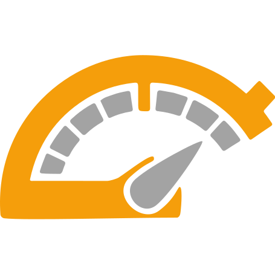

<p align="center">
  
  <span style="font-size: 2.5em; font-weight: bold; vertical-align: middle;">Binge Meter</span>
</p>
  <p align="center" style="font-size: 1.5em; margin-top: 8px;">This extension shoves your wasted time in your face</p>


Tired of falling down rabbit holes on YouTube, Reddit, or X and wondering where the hell your day went? <br /> **Binge Meter** is a browser extension that tracks your time on distracting sites and uses (optional) AI to classify what's a waste of time, so you can actually get your work done

---

## Features

- 🧠 **Self-Improving AI**: Uses a Bring-Your-Own-Key model for Google's Gemini to classify current page. It learns from your manual classifications and your Custom Instructions

- ⏱️ **On-Screen Timer**: A customizable overlay that shows your binge time in real-time on distracting sites

- 🚫 **Site Blocking**: Locks you out of distracting sites when the daily time limit is reached. Can also grant a grace period

- 📊 **Analytics Dashboard**: Get a reality check with charts showing total binge times and a breakdown of your top time-wasting sites

- 📝 **Granular Control**: Manually mark specific URLs, YouTube channels, or subreddits as productive, and create exceptions for the blocking

- 🔎 **Smart URL Matching**: Ignores query params and it can use wildcards (`*`)

- 🔐 **Per-Site Permissions**: Only asks permissions for the sites you explicitly tell it to track

---

## Getting Started 🚀

1. **Install the Extension**: 
   - (Publising on Chrome Web Store and Firefox Add-ons is pending)

2. **Track Your First Site**
   - Go to a site you want to monitor (e.g., `youtube.com`)
   - Click the **Binge Meter icon** in your browser's toolbar (Pin it for quick access)
   - Click **"Grant Permission"**, then **"Track"**. The extension will now monitor this domain

3. **Just Browse**
   - Drag and resize the Overlay, it will remember your preferences per site
   - You can click the extension icon for granular control over classification and exceptions

4. **Tweak the Settings (Recommended)**
   - Click the **Settings** button in the popup
   - **Enable AI Classification**  Set your Gemini API key and optionally, custom instructions
   - **Set Your Limit:** In Blocking section, enable Blocking and set your daily time limit
   - **Customize Overlay**: Set threshold time and colors, make it your own

5. **Check Your Stats**
   - After a few days, open the **Analytics** page from the popup to see a breakdown of where your time *really* goes

---

## Tech Stack 🛠️

- **Core**: TypeScript (Background and Content Scripts)
- **UI** (Popup, Settings, Analytics):
  - React
  - Tailwind CSS
  - Zustand
  - Shadcn UI
  - Recharta
- **Build**: Vite + CRXJS

---

## Building From Source 👨‍💻

**Prerequisites:**

- Node.js (v18 or higher)
- pnpm

```bash
# Clone the repo
git clone https://github.com/sahaj-b/binge-meter.git
cd binge-meter

# Install dependencies
pnpm install

# Run the dev server
pnpm dev
# This will create unpacked extension in dist/ dir and watch for changes

# Create a production build
pnpm build
# This will generate a production-ready, zipped package in the release/ directory, and an unpacked version in dist/
```

> [!NOTE]
>
> - Dev mode is only supported in Chromium-based browsers
> - For Firefox build, uncomment the `browser` line in `vite.config.ts` before building
> - For enabling debug messages in production build, set `VITE_DEBUG_MODE` environment variable to `true` before building
