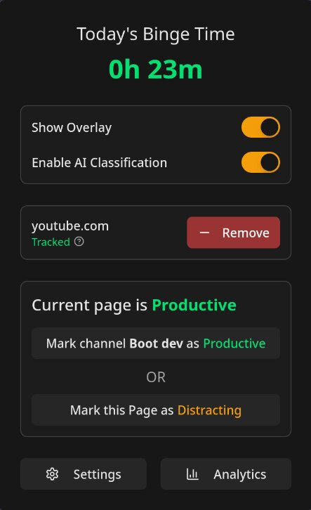

<div align="center">
  
  <h1>Binge Meter</h1>
</div>

<h3 align="center">
  This extension shoves your wasted time in your face
</h3>

<table>
  <tr>
    <td align="center">
      <br>
    <sub>Popup</sub>
    </td>
    <td align="center">
      <br>
    <sub>Analytics</sub>
    </td>
    <td align="center">
      <br>
    <sub>Settings</sub>
    </td>
  </tr>
  <tr>
    <td align="center">
      <br>
      <sub>Overlay</sub>
    </td>
    <td align="center">
      <br>
      <sub>Blocking</sub>
    </td>
    <td align="center">
      <br>
      <sub>Styles</sub>
    </td>
  </tr>
</table>

Tired of falling down rabbit holes on YouTube, Reddit, or X and wondering where the hell your day went? <br /> **Binge Meter** is a browser extension that tracks your time on distracting sites and uses (optional) AI to classify what's a waste of time, so you can actually get your work done

---

## Features

- 🧠 **Self-Improving AI**: Uses Google's Gemini to figure out if current page is *productive* or *distracting*. It learns from your manual classifications and your Custom Instructions

- ⏱️ **On-Screen Timer**: A customizable overlay that shows your binge time in real-time on distracting sites

- 🚫 **Site Blocking**: Locks you out of distracting sites when the daily time limit is reached. Can also grant a grace period

- 📊 **Analytics Dashboard**: Get a reality check with charts showing total binge times and a breakdown of your top time-wasting sites

- 📝 **Granular Control**: Manually mark specific URLs, YouTube channels, or subreddits as productive, and create exceptions for the blocking

- 🔎 **Smart URL Matching**: Ignores query params and it can use wildcards (`*`)

- 🔐 **Per-Site Permissions**: Only asks permissions for the sites you explicitly tell it to track

---

> [!NOTE]
> ### A Quick Heads-Up on the opt-in AI Feature
>
> - **BYOK (Bring Your Own Key):** You'll need to provide your own Google AI API key to enable it.
> - **Model:** By default, it uses the **Gemini 2.5 Flash Lite** model. You can change this in the settings.
> - **Rate Limits:** See [Free tier Gemini rate limits](https://ai.google.dev/gemini-api/docs/rate-limits) (Also available in the Settings page)
> - Each **new** page you visit on a tracked site counts as one request (if it doesn't match any existing rules)


## Get Started 🚀

1. **Install the Extension**: 
   - Chromium-based browsers: [Chrome Web Store](https://chromewebstore.google.com/detail/binge-meter/jlbijnlhiaaophloidngjkdfmdopnagh)
   - Firefox/Firefox-based browsers: [Firefox Add-ons](https://addons.mozilla.org/en-US/firefox/addon/binge-meter/)

2. **Track Your First Site**
   - Go to a site you want to monitor (e.g., `youtube.com`)
   - Click the **Binge Meter icon** in your browser's toolbar (Pin it for quick access)
   - Click **"Grant Permission"**, then **"Track"**. The extension will now monitor this domain

3. **Just Browse**
   - Drag and resize the Overlay, it will remember your preferences per site
   - You can click the extension icon for granular control over classification and exceptions

4. **Tweak the Settings (Recommended)**
   - Click the **Settings** button in the popup
   - **Enable AI Classification**  Set your Gemini API key and optionally, custom instructions
   - **Set Your Limit:** In Blocking section, enable Blocking and set your daily time limit
   - **Customize Overlay**: Set threshold time and colors, make it your own

5. **Check Your Stats**
   - After a few days, open the **Analytics** page from the popup to see a breakdown of where your time *really* goes

---

## Tech Stack 🛠️

- **Core**: TypeScript (Background and Content Scripts)
- **UI** (Popup, Settings, Analytics):
  - React
  - Tailwind CSS
  - Zustand
  - Shadcn UI
  - Recharts
- **Build**: Vite + CRXJS

---

## Building From Source 👨‍💻

**Prerequisites:**

- Node.js (v18 or higher)
- pnpm

```bash
# Clone the repo
git clone https://github.com/sahaj-b/binge-meter.git
cd binge-meter

# Install dependencies
pnpm install

# Run the dev server
pnpm dev
# This will create unpacked extension in dist/ dir and watch for changes

# Create a production build for chromium-based browsers
pnpm build
# OR for firefox-based browsers
pnpm build:firefox
# This will generate a production-ready, zipped package in the release/ directory, and an unpacked version in dist/
```

> [!NOTE]
>
> - Dev mode is only supported in Chromium-based browsers
> - For enabling debug messages in production build, set `VITE_DEBUG_MODE` environment variable to `true` before building

## Planned stuff for Future 🚧

- Display (in popup) whether the classifcation was done by AI or manually
- Add a "Delete Data" button in Analytics page
- Require unlimited storage permission (or delete old data) when analytics data grows too large
- Double-click overlay to mark as distracting

## FAQ 💬

**Q: Are you stealing my Browse history?**

**A:** Hell no. All your data, your tracked sites, time logs, settings, everything is saved **locally on your own computer** using the browser's storage. It never gets sent anywhere, unless you *explicitly* enable AI classification, in which case the page's metadata is sent to Google's AI API for classification.

**Q: Do I have to use the AI? Is it free?**

**A:** The AI is **100% optional**. The extension works perfectly fine as a manual time tracker without it. Google offers a generous free tier that is more than enough for heavy personal use. see the [AI section](#a-quick-heads-up-on-the-opt-in-ai-feature) above for more details.

**Q: Are AI calls made on every navigation?**

**A:** No. AI calls are only made when you visit a **new** page on a tracked site that doesn't match any existing rules. If you navigate to a page that has already been classified by AI, it will use the cached classification. you can see the free tier rate limits in the Settings page.

**Q: What exactly is sent to the AI?**

**A:** To be clear, none of your personal info is sent. The AI only gets the page's metadata to judge its content, which includes:
  - The page's full URL and Title
  - `<meta>` tags (like description, keywords, etc.)
  - On specific sites like YouTube, it also includes video details like the title, description, channel name, and channel ID.

**Q: Can I sync my data between different computers or browsers?**

**A:** Not right now. Because all data is stored locally for privacy, it's tied to the specific browser profile on the computer you're using. And there's no cloud sync functionality.

**Q: The AI classifies stuff wrong. What to do?**

**A:** That's exactly what manual rules ans Custom Instructions are for. If the AI gets it wrong, manually mark the page distracting/productive, the AI will learn from your manual classifications over time. You can also set Custom Instructions to tell the AI what you consider productive or distracting in Settings

**Q: Can I contribute to the project?**

**A:** Hell yes. This is an open-source project, if you find a bug, have a feature idea, or want to improve something, please open an issue on the [GitHub Issues page](https://github.com/sahaj-b/binge-meter/issues) to discuss it. Pull requests are always welcome.
